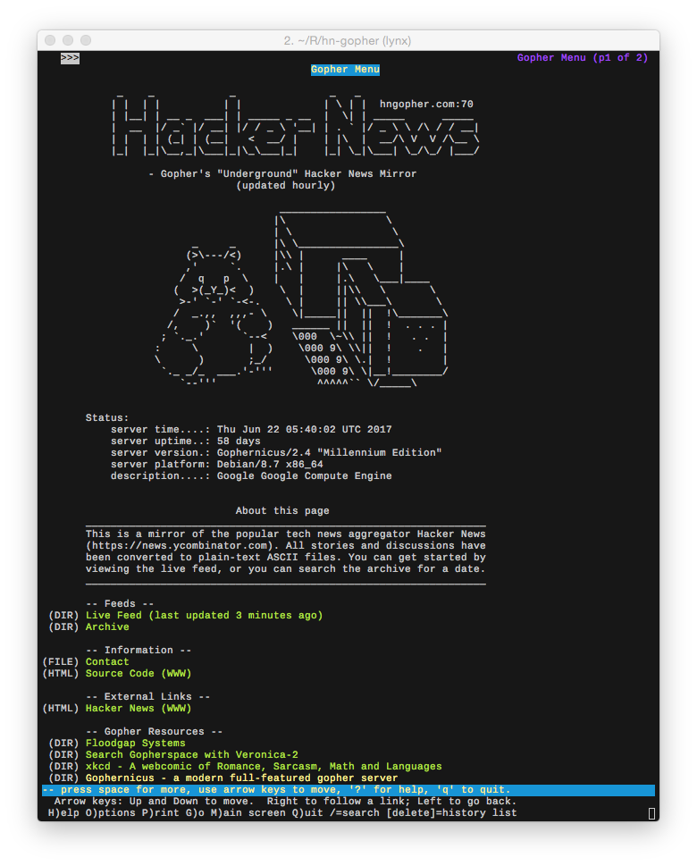
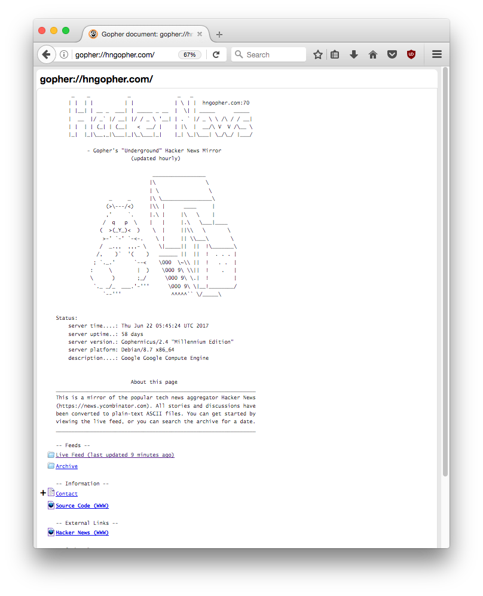
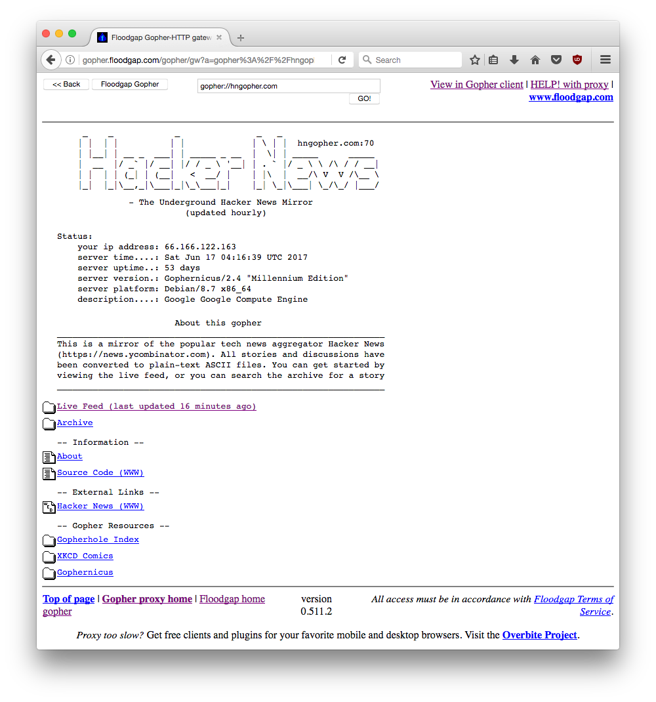

# HN Gopher

HN Gopher is a read-only mirror for https://news.ycombinator.com/ (a.k.a. Hacker News) served using the [Gopher Protocol](https://en.wikipedia.org/wiki/Gopher_(protocol)). 

* **gopher://hngopher.com** (see the section on "How to view this site")

This project was created for my own enjoyment, and to learn about gopher and the history of the internet before the world wide web.

*This is not endorsed by or affiliated with the Y Combinator company*

## How to view this site

Unfortunately, the gopher protocol hasn't been supported by major web browsers since the early 2000's. However, there are still a few good options for accessing Gopher in the modern age.

- Use **lynx** from the command line
   ```bash
   $ lynx gopher://hngopher.com
   ```


- Install the free [OverbiteFF](https://addons.mozilla.org/en-US/firefox/addon/overbiteff/)
   addon for Firefox


   
- As a last resort, Floodgap has setup a gateway that converts *gopher* to *http* so it
   can be viewed from any browser.
   - http://gopher.floodgap.com/gopher/gw?a=gopher%3A%2F%2Fhngopher.com




## How to deploy this project

The server currently runs on Debian 8.7, but it should work on any Linux system that's capable of building [gophernicus](https://github.com/prologic/gophernicus). There's a ``deploy.sh`` script included in the repo that can be used
to automatically setup a server. The server is managed by systemd and listens on port 70 by default. Gopher
pages are stored as static files in the **/var/gopher** directory. Pages are updated by a couple of cron jobs
that ping the [Hacker News API](https://hacker-news.firebaseio.com/v0/) and [Algolia HN Search API](https://hn.algolia.com/api/v1/).

```bash
$ git clone https://github.com/michael-lazar/hn-gopher.git
$ cd hn-gopher
$ sudo ./deploy
```
