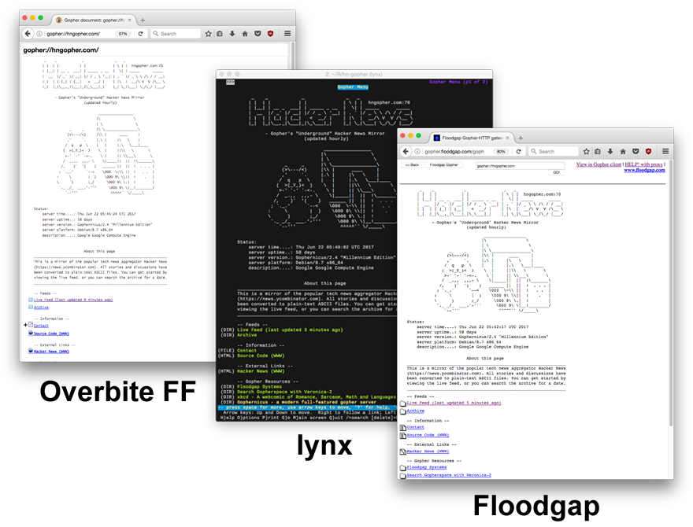

# HN Gopher

```
           	               _    _            _               _   _
                              | |  | |          | |             | \ | |  hngopher.com:70
                              | |__| | __ _  ___| | _____ _ __  |  \| | _____      _____
                              |  __  |/ _` |/ __| |/ / _ \ '__| | . ` |/ _ \ \ /\ / / __|
                              | |  | | (_| | (__|   <  __/ |    | |\  |  __/\ V  V /\__ \
                              |_|  |_|\__,_|\___|_|\_\___|_|    |_| \_|\___| \_/\_/ |___/
	
                              - Gopher's "Underground" Hacker News Mirror
                                            (updated hourly)
	
	                                           _________________
                                                  |\                \
	                                          | \                \
	                             _     _      |\ \________________\
                                    (>\---/<)     |\\ |      ____     |
                                    ,'     `.     |.\ |     |\   \    |
                                   /  q   p  \    |   |     |.\   \___|____
                                  (  >(_Y_)<  )    \  |     ||\\   \       \
                                   >-' `-' `-<-.    \ |     || \\___\       \
                                  /  _.,,  ,,,- \    \|_____||  ||  !\_______\
                                 /,    )`  '(    )   ______ ||  ||  !  . . . |
                                ; `._.'      `--<    \000  \~\\ ||  !   . .  |
                               :     \        |  )    \000 9\ \\||  !    .   |
                               \      )       ;_/      \000 9\ \.|  !        |
                                `._ _/_  ___.'-'''      \000 9\ \|__!________/
                                   `--'''                ^^^^^`` \/_____\
```

---

**gopher://hngopher.com** (see below on "How to view this site")

---

HN Gopher is a read-only mirror for https://news.ycombinator.com/ served using the [gopher protocol](https://en.wikipedia.org/wiki/Gopher_(protocol)). I created this site for my own enjoyment, and to learn about gopher and the history of the internet before the world wide web.

## How to view this site

Unfortunately, the gopher protocol hasn't been supported by major web browsers since the early 2000's. However, there are still a couple of options for accessing Gopher in the modern age.

- Install the free [OverbiteFF](https://addons.mozilla.org/en-US/firefox/addon/overbiteff/)
   addon for Firefox
   
- Use **lynx** from the command line
   ```bash
   $ lynx gopher://hngopher.com
   ```
   
- As a last resort, Floodgap provides a gateway that converts **gopher** sites to **HTTP** so they can be viewed in your browser
  http://gopher.floodgap.com/gopher/gw?a=gopher%3A%2F%2Fhngopher.com
   



## How to deploy this project

The server currently runs on Debian 8.7, but it should work on any Linux system that's capable of building [gophernicus](https://github.com/prologic/gophernicus). There's a ``deploy.sh`` script included in the repo that can be used
to automatically setup a server. The server is managed by systemd and listens on port 70 by default. Gopher
pages are stored as static files in the **/var/gopher** directory. Pages are updated by a couple of cron jobs
that ping the [Hacker News API](https://hacker-news.firebaseio.com/v0/) and [Algolia HN Search API](https://hn.algolia.com/api/v1/).

```bash
$ git clone https://github.com/michael-lazar/hn-gopher.git
$ cd hn-gopher
$ sudo ./deploy
```

## License

AGPLv3

*This project is not affiliated with, maintained, authorized, endorsed or sponsored by the Y Combinator company.*

