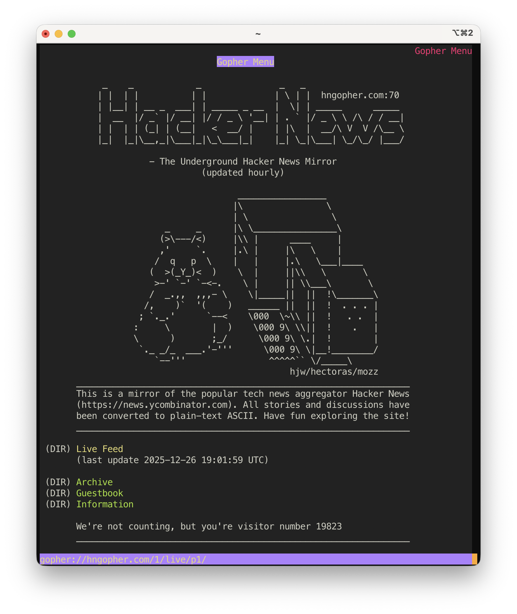

---

<p align="center">
<b><a href="gopher://hngopher.com">gopher://hngopher.com</a></b><br>
<i>(see below for "How to view this site")</i>
</p>

---

HN Gopher is a read-only mirror for https://news.ycombinator.com/ served using the [gopher protocol](https://en.wikipedia.org/wiki/Gopher_(protocol)). I created this site for my own enjoyment, and to learn about gopher and the history of the internet before the world wide web.

## How to view this site

The gopher protocol hasn't been supported by major web browsers since the early 2000's. Thankfully, there are still a few ways to browse Gopherspace in the modern age:
   
- Use **lynx** from the command line
   ```bash
   $ lynx gopher://hngopher.com
   ```
   
- Floodgap provides a proxy gateway that converts **gopher** sites to **HTTP** so they can be viewed in your browser:
  [http://gopher.floodgap.com/gopher/gw?a=gopher%3A%2F%2Fhngopher.com](http://gopher.floodgap.com/gopher/gw?a=gopher%3A%2F%2Fhngopher.com)

## Development quickstart

Docker compose is used for local development

```
docker compose build hngopher  # Build the container

tools/hn-scrape          # Scrape stories from Hacker News
tools/hn-archive         # Copy current stories to the archive
tools/hn-guestbook dump  # Initialize the guestbook
tools/start              # Start the dev server

lynx gopher://localhost:7070      # Connect to the dev server
```

## How to deploy this project

The official server runs on Debian, but it should work on any Linux system that's capable of building [gophernicus](https://github.com/prologic/gophernicus). There's a ``deploy.sh`` script included in the repo that can be used
to install the server and associated scripts. The gophernicus service is managed by **systemd** and listens on port 70 by default.
Gopher pages are stored as static files in the **/var/gopher** directory. Files are continuously updated by cron jobs
that ping the [Hacker News API](https://hacker-news.firebaseio.com/v0/) and [Algolia HN Search API](https://hn.algolia.com/api/v1/).

```bash
$ git clone https://github.com/michael-lazar/hn-gopher.git
$ cd hn-gopher
$ sudo ./deploy.sh
```

## Disclaimer

*This project is not affiliated with, maintained, authorized, endorsed or sponsored by the Y Combinator company.*

## License

[The Human Software License](https://license.mozz.us)

> A hobbyist software license that promotes maintainer happiness
> through personal interactions. Non-human
> [legal entities](https://en.wikipedia.org/wiki/Legal_person) such as
> corporations and agencies aren't allowed to participate.
